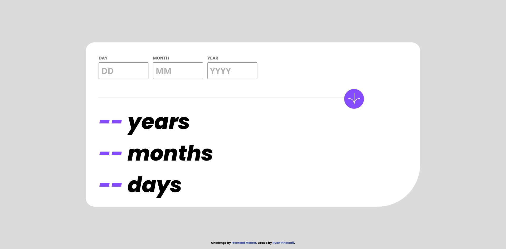

# Frontend Mentor - Age calculator app solution

This is a solution to the [Age calculator app challenge on Frontend Mentor](https://www.frontendmentor.io/challenges/age-calculator-app-dF9DFFpj-Q). Frontend Mentor challenges help you improve your coding skills by building realistic projects. 

## Table of contents

- [Overview](#overview)
  - [The challenge](#the-challenge)
  - [Screenshot](#screenshot)
  - [Links](#links)
- [My process](#my-process)
  - [Built with](#built-with)
  - [What I learned](#what-i-learned)
  - [Continued development](#continued-development)
- [Author](#author)


**Note: Delete this note and update the table of contents based on what sections you keep.**

## Overview
The technology used to build this app is HTML5, CSS, and Javascript.  Using those technologies I built this app to look as close to the original design as possible, just from the pictures.

### The challenge

Users should be able to:

- View an age in years, months, and days after submitting a valid date through the form
- Receive validation errors if:
  - Any field is empty when the form is submitted
  - The day number is not between 1-31
  - The month number is not between 1-12
  - The year is in the future
  - The date is invalid e.g. 31/04/1991 (there are 30 days in April)
- View the optimal layout for the interface depending on their device's screen size
- See hover and focus states for all interactive elements on the page
- **Bonus**: See the age numbers animate to their final number when the form is submitted

### Screenshot



### Links

- Solution URL: [https://github.com/rdpinkst/age-calculator-app-main]
- Live Site URL: [https://rdpinkst.github.io/age-calculator-app-main/]

## My process
Building this project, initially I designed the HTML5 markup.  With all the markup on the page I started to style the app with CSS.  When the page was looking close to the design images I added functionality into the page with Javascript.  

### Built with

- Semantic HTML5 markup
- CSS 
- Flexbox
- Javascript

### What I learned

A little tidbit that I learned while working on form validation was that to make the input not move up and down when an incorrect input occurred, give the tag where the error will display a height. Example of that can be seen below: 

```html
<input type="text">
<small class="give-height-for-error"></small>
```
```css
.give-height-for-error {
  height: 1rem;
}
```

### Continued development

In future development I need to learn more about Semantic HTML, and work on getting better at using Semantic HTML in my projects, and not divs all the time.  I also need to work on my responsive design.  In completing this project I was able to get the mobile design at 375px close to design picture and desktop design to look alright, but the inbetween break points did not look good at times.

## Author

- Frontend Mentor - [@rdpinkst](https://www.frontendmentor.io/profile/rdpinkst)
